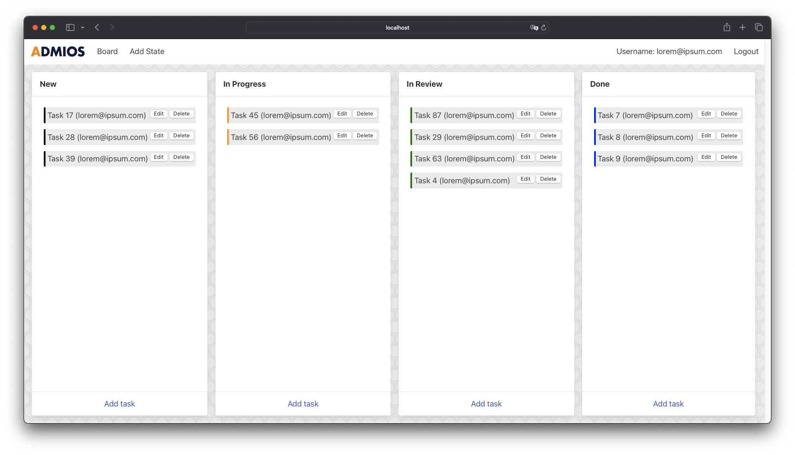

# Task Board

Task Board is an open-source generic task management and collaboration tool. We built it to offer an easy and customizable way to view, manage, and share your tasks.

## Quickstart

Requirements: NodeJS 26+ is installed (`.nvmrc` pins this — run `nvm use` if you use nvm). `node:sqlite`, the built-in module this app uses as its database, is stable as of Node 26 (no more `ExperimentalWarning` at startup).

1. Install dependencies with `npm install`
1. Migrate the tables: `npm run db:migrate`. This applies `db/schema.sql` to a local SQLite file.
1. Run `npm run dev`.
1. Open `localhost:3000` on your web browser.

## Running unit tests

Requirements: NodeJS installed

1. Install dependencies with `npm install`
1. Run `npm test`

Should work out of the box — no separate test database to set up. `jest.setup.ts` points every test run at `SQLITE_PATH=":memory:"`, so each test file gets its own throwaway in-memory SQLite database and applies the schema itself; nothing is migrated, seeded, or read from `data/tasks.db` / `data/tasks_test.db`.

## Running end-to-end tests

Requirements: NodeJS 26+ is installed.

1. Migrate the test database: `npm run db:migrate-test`. This applies `db/schema.sql` to the test SQLite file (`SQLITE_PATH` from `.env.test`).
1. Register a user matching `cypress/fixtures/users.json`, then seed demo data: `npm run db:seed` (with `NODE_ENV=test`).
1. Run the server with `npm run dev:test` and leave it running.
1. Run `npm run test:e2e` in another console.

All tests should pass.

## Database Management Scripts

- `npm run db:migrate` applies `db/schema.sql` to the development database.
- `npm run db:migrate-test` applies `db/schema.sql` to the test database (for e2e testing).
- `npm run db:seed` seeds the database with demo data, but only if there are users already in the database. It takes five random users and generates them some random tasks.
- `npm run db:clear` empties the database tables.

## Cypress Scripts

- `npm run test:e2e` runs the end-to-end tests with Cypress. The application must already be running in order for the tests to work.
  - This is actually a wrapper for `npm run cy:run` with correct environment variables.
- `npm run cy:open` Opens the Cypress interface
- `npm run cy:run` Runs the Cypress tests.

## Stack

Task Board is a monolithic application built over NextJS 13. It should only require a database instance and a web server instance. Here we list all the design considerations we had while building this application:

### NextJS Server Side Components

Task Board is built from scratch with React Server Side Components. Queries between the frontend and the backend are abstracted with the `"use client"` and `"use server"` directives at the top of the file. These directives allow certain files to retrieve the data inside the server and pass it to the client as React Props.

### NextJS Server Actions

We use NextJS Server Actions to handle AJAX requests from the frontend. You can recognize those files because their first line is `"use server"`.

### NextJS App Router

In order to be able to use the new features of NextJS 13 we have to use the new router. All client-accessible routes therefore live in the `src/app` folder, which in turn calls components that live in the `src/templates` folder. We called it "template" because the "pages" folder name is reserved for the old router which we are not using.

### User Authentication: Passkeys via WebAuthN

No passwords! You can log in with your fingerprint! We are using the new Passkey Authentication scheme to verify users and to allow them to log in. We use the `simplewebauthn` library to handle the authentication process. The standard is still not fully implemented in every possible client, however, and some users will require a Fido2 compatible device to log in. Your mileage will vary!

These are the tested platforms:

- Safari in MacOS works with TouchID.
- Chromium Forks work with TouchID on MacOS, and with the integrated password manager in Windows. Tested with Brave Browser.
- Firefox DOES NOT work with TouchID, but it does work with a Fido2 compatible device in all OSs
- 1Password Plugin for browsers is not working yet. Known issue.
- Windows Hello: not tested yet.

#### User Authentication Flow

- User navigates to `/login` and clicks on the "Authorize" button.
- A Server Action takes the username/email and returns a cryptographic challenge to the client.
  - If the user is already registered, the challenge will require the user to use an existing "Authenticator".
  - Either way, the challenge is saved to the database as an "AuthenticatorChallenge", which will be retrieved later in the process.
- The client receives the challenge and uses the `simplewebauthn` library to request the user to sign the challenge with a biometric device.
  - If the user is already registered, `simplewebauthn` will only allow the user to use an authenticator that is already enrolled in the database.
  - If the user is not registered, `simplewebauthn` will allow the user to use any authenticator they wish.
- A Server Action receives the challenge from the client.
  - We retrieve the "AuthenticatorChallenge" for this user to check the challenge.
  - If the user is not registered, and the challenge is valid, the server will save the new User and the used Authenticator to the database.
  - Either way, if the challenge is valid, the server deletes the "AuthenticatorChallenge".
- If the authentication succeeds, the server will set a `userId` HTTP-only cookie that will determine the current user.

### Styling: Bulma + SASS + CSS Modules

We are using Bulma CSS for the UI components. The big advantage of Bulma is that it is written in SASS and we can compile it to pure CSS. That CSS is then a lot easier to serve for out application because it is a series of static files. We do require handling some functionality with JavaScript, like showing and hiding Modal Dialogs, but that is stuff that we already handle with React. We saved around 100 kB of bundle size when migrating from Chakra UI. We also write some SASS files to handle extra styling, and it is added to the output via CSS Modules.

### Zustand State Management

We use Zustand to manage the state of the application on the client side. Zustand is a very simple state management library that uses React Hooks and we use it as a replacement for Redux.

### SQLite Database

This application uses Node's built-in `node:sqlite` module as its database — no external database process, no Docker. The schema lives in a single idempotent file, `db/schema.sql`, applied by `npm run db:migrate`. The database file location is controlled by the `SQLITE_PATH` environment variable (`./data/tasks.db` for development, `./data/tasks_test.db` for e2e tests). Foreign keys are enforced (`PRAGMA foreign_keys = ON`), so writes that touch multiple tables run inside a transaction, parent row before child row.
